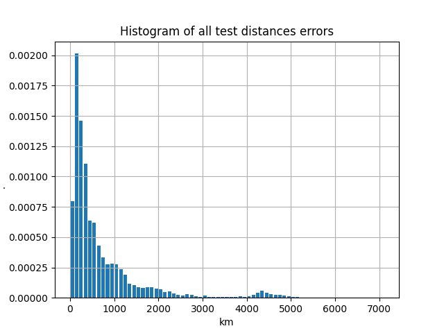

 # Deep Learning model to predict geolocation of tweets

 ## General information

 ### Task
 The goal is to create and train a deep learning model which predicts coordinates (latitude, longitude) of individual tweets.

### Data
The data consists of csv files ([`raw_data_dir`](./hparams.py#L5)) where each line contains directly text itself and information about the location of the area (bottom left and top right coordinates of a "rectangular") where the tweet was made plus some meta data. Data contains tweets from South America. There are approximately 10^7 individual tweets in different languages. 

 ### Model
Here a generative approach is considered. The proposed model takes UTF-8 encoding text as input. The model architecture consists of  a character embedding layer followed by the series of CNN, BN and Pooling layers. As a result N coefficients are obtained which represent the coefficients of decomposition by basis of N von Mises-Fisher PDFs. The parameters of the basis functions are trained as well as layers' parameters.

## Training procedure
### General
First of all the train and test datasets are prepared. 95% of all data is considered as the train part, while the rest is the test. The raw information is processed and saved in corresponding files ([`train_dset_file`, `test_dset_file` fields](./hparams.py#L11-L12)) for further training. The average values of the input data are calculated so normalized data are considered. Also the cleaning for data is implied. Only tweets which "rectangular" area's "diagonal" is less than 500 km ([`max_dist` field](./hparams.py#L19)) are taken into account. Otherwise such data only confuses our model during training. For calculating the distsnce between two points on sphere the vincenty inverse formula is used ([here you can find the implementation](./helper.py#L50))

After this the training loop starts. Each epoch the statistic is provided, which includes average test error values, percentiles and histograms for test errors. 

### Debugging
During implementing the task several debug features were introduced. First of all it is quite easy to consider only specific part of the train and test datasets ([`part_of_train`, `part_of_test` fields](./hparams.py#L22-L23)). Also function [`plot_test`](./helper.py#L234) can be used instead of [`test_all`](./helper.py#L254) for tracking the statistics of one train and one test samples. It is possible to plot the result distribution mixture for the specific sample, an example graph looks like [this](./results/debug_plot_example.png).

### Source code files description

- [train.py](./train.py) - the base training script
- [dataset.py](./dataset.py) - source code regarding datasets
- [model.py](./model.py) - model class and support functions
- [helper.py](./helper.py) - the other utility functions
- [hparam.py](./hparam.py) - the file with hyper parameters of the training process and other settings
- [inference.py](./inference.py) - script for processing data through the saved model

## Results
Here, you can see the results of test data errors.

- Average error distance = 703.76 km
- Quantile 0.9 = 1648.51 km
- Quantile 0.75 = 840.65 km
- Quantile 0.5 = 356.89 km

The trained model can be found [here](https://drive.google.com/file/d/1TSvW1Kgt4LPq-jy54FB1B5jQXr7QtGyK/view?usp=sharing).
